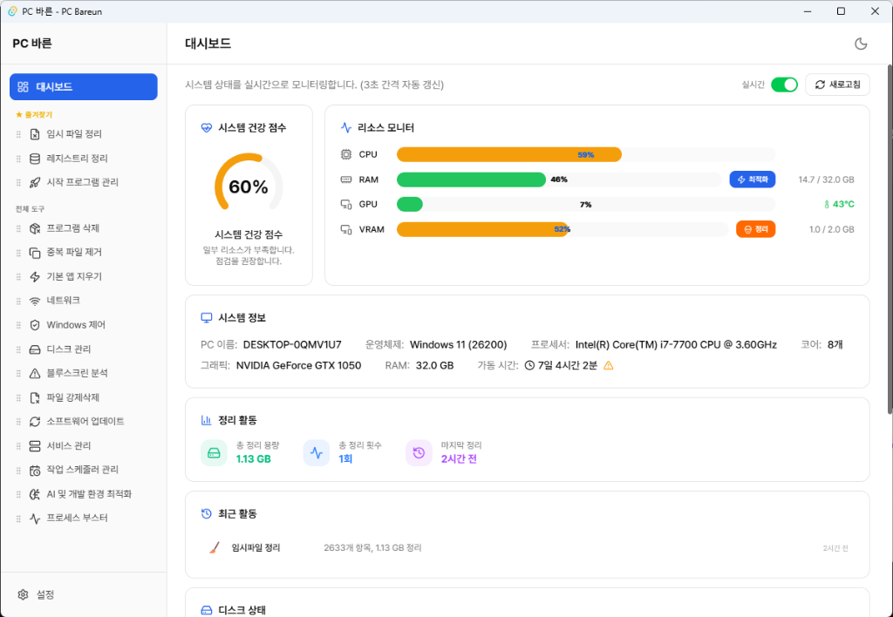
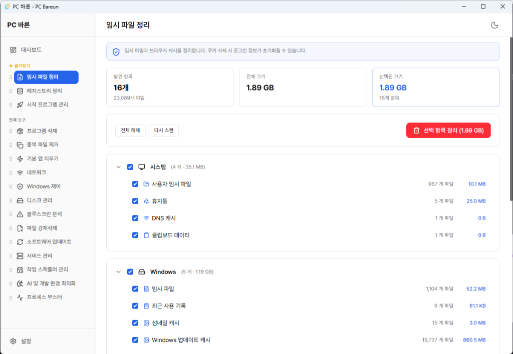
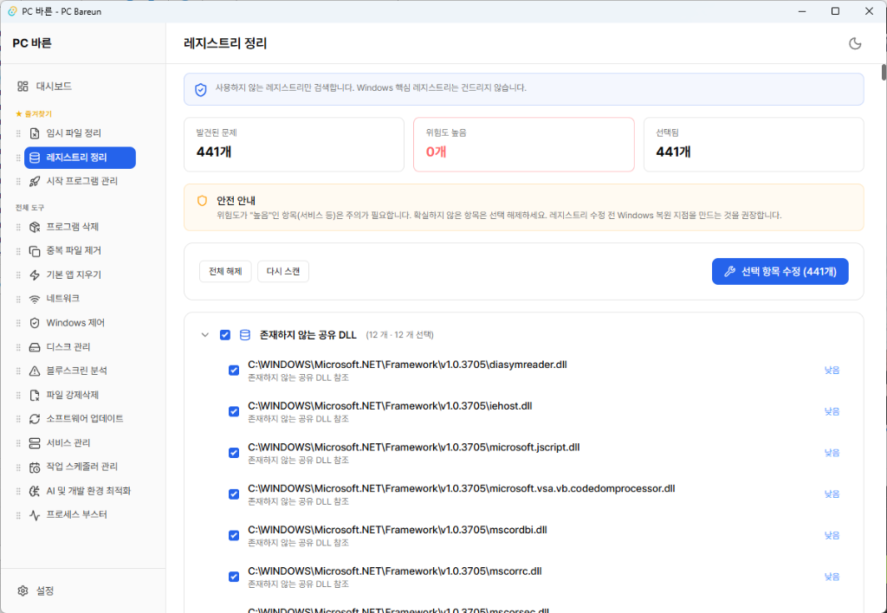
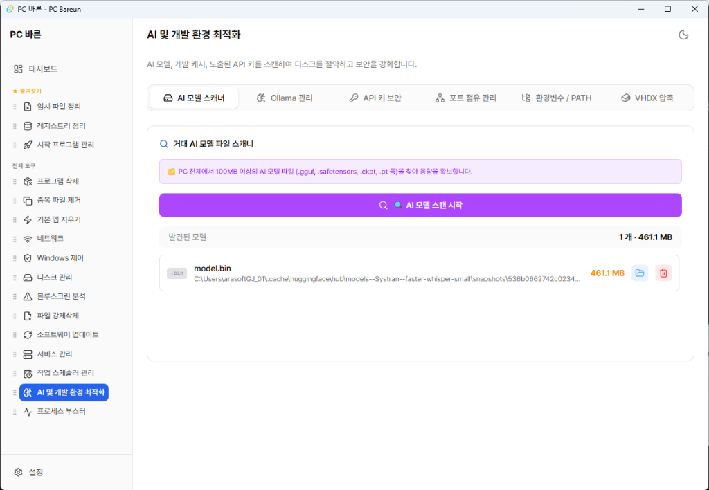

# 🖥️ PC 바른 (PC Bareun)

**당신의 PC를 바르게.**

Windows 10/11을 위한 올인원 PC 관리 유틸리티

---

## 📸 스크린샷

| 대시보드 | 임시 파일 정리 |
|:---:|:---:|
|  |  |

| 레지스트리 정리 | AI & 개발 환경 최적화 |
|:---:|:---:|
|  |  |

---

## ✨ 주요 특징

- 🧹 **시스템 정리** — 임시 파일, 레지스트리, 중복 파일, 유사 이미지 정리
- 🔧 **시스템 관리** — 시작 프로그램, 서비스, 작업 스케줄러, 프로그램 삭제
- 🛡️ **보안 & 개인정보** — 텔레메트리 차단, DNS 검사, API 키 탐지, 개인정보 클리너
- 💾 **디스크 관리** — S.M.A.R.T. 진단, 폴더 용량 분석, Secure Erase
- 🤖 **AI & 개발자 도구** — AI 모델 스캐너, Ollama, 포트 관리, 환경변수/PATH, VHDX
- 🌍 **다국어 지원** — 한국어, English, 日本語

---

## 📥 다운로드

**[👉 최신 버전 다운로드](https://pcbareun-updater-proxy.teemozipsa.workers.dev/download)**

### 시스템 요구사항
- Windows 10 (1809 이상) 또는 Windows 11
- 64비트 (x64)
- [WebView2 Runtime](https://developer.microsoft.com/edge/webview2/) (Windows 11은 기본 포함)

---

## 📜 라이선스

**Copyright © 2026 TeemoZipsa. All Rights Reserved.**

이 소프트웨어는 **무료**로 제공되지만, 소스코드의 복제·수정·재배포는 허용되지 않습니다.

---

**PC를 바르게 쓰기 위해 만들었습니다**

[🌐 공식 사이트](https://teemozipsa.github.io/PCBareun-site/)

