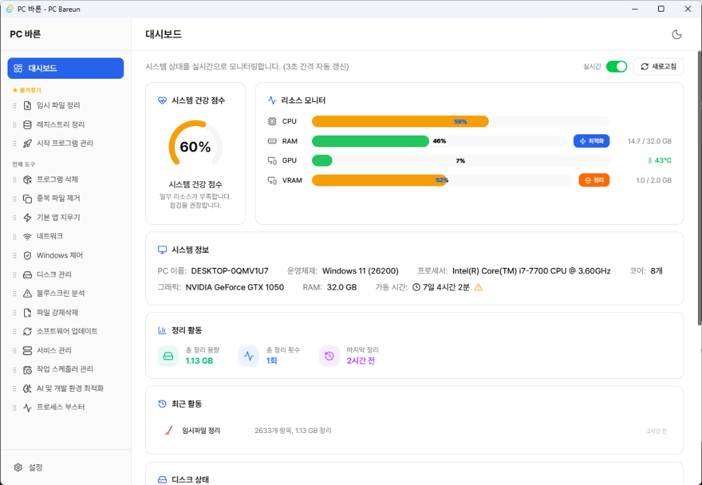
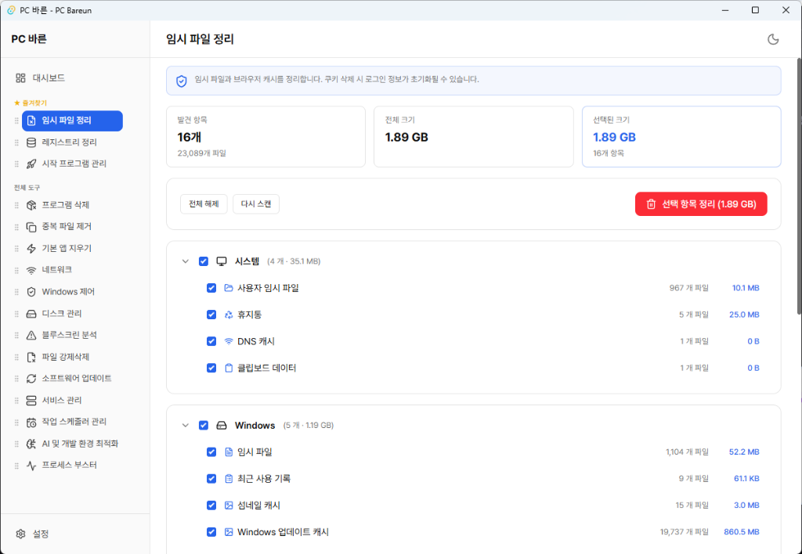
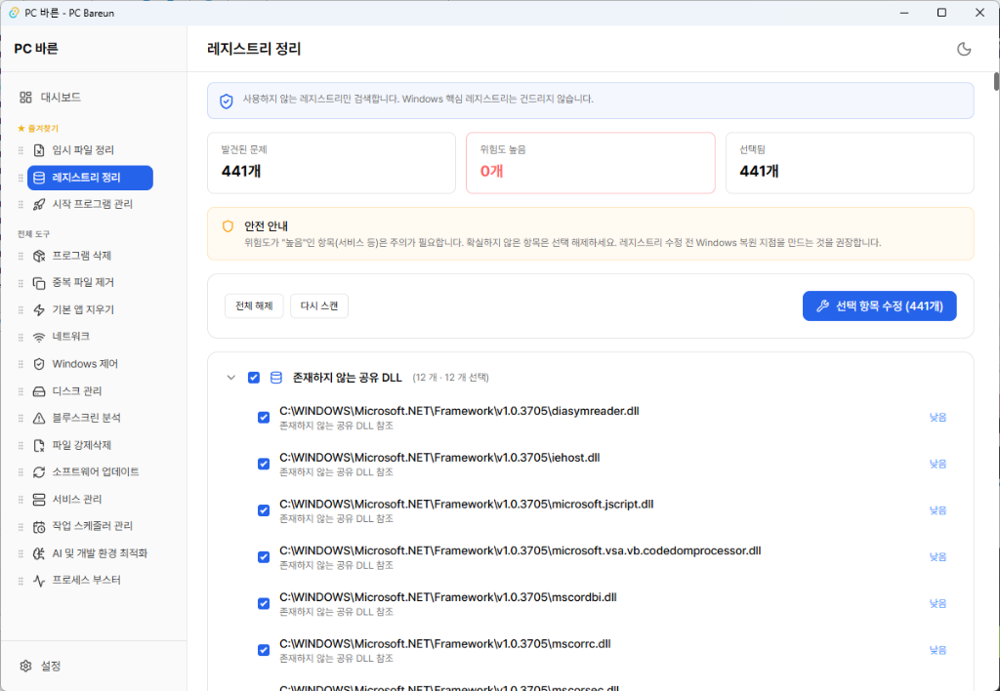
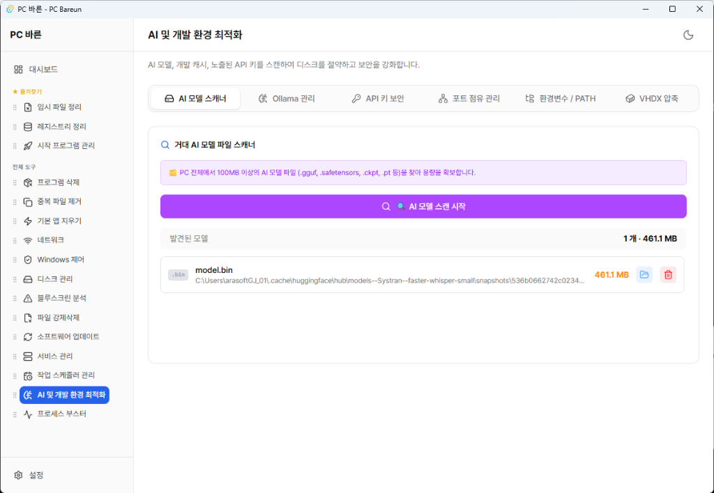

# PC 바른 공식 사이트

**Windows PC 정리와 진단을 한곳에서.**

Windows 10/11을 위한 무료 PC 정리·진단 유틸리티 · Microsoft Store · Direct v0.4.2

---

## 이 저장소

이 저장소는 PC 바른의 공개 홈페이지와 릴리즈 노트를 관리합니다.

- 공식 사이트: <https://teemozipsa.github.io/PCBareun-site/>
- Microsoft Store: <https://apps.microsoft.com/detail/9NJ36D4PLJ8H>
- Direct 다운로드: <https://pcbareun-updater-proxy.teemozipsa.workers.dev/download>
- 릴리즈 노트: [`release_notes.md`](release_notes.md)
- 피드백: <https://github.com/teemoZipsa/PCBareun-site/issues/new/choose>

---

## 스크린샷

| 대시보드 | 임시 파일 정리 |
|:---:|:---:|
|  |  |

| 레지스트리 정리 | AI & 개발 환경 정리 |
|:---:|:---:|
|  |  |

---

## 주요 특징

- **정리** — 임시 파일, 레지스트리, 중복 파일, 유사 이미지 정리
- **진단** — S.M.A.R.T. 디스크 상태, 폴더 용량, BSOD, 네트워크 점검
- **앱 관리** — 시작 프로그램, 서비스, 작업 스케줄러, 설치 프로그램 확인
- **보안 점검** — DNS/hosts 이상 징후 확인, API 키 노출 후보 탐지, 사용 흔적 정리
- **AI·개발 환경 정리** — 대용량 AI 모델 탐지, Ollama 모델 정리, 개발 캐시 확인
- **다국어 지원** — 한국어, English, 日本語

Microsoft Store판은 정리·진단 중심으로 구성하고, 시스템 변경 폭이 큰 고급 제어 기능은 직접 다운로드 빌드에서 분리합니다.

---

## 다운로드

- **[Microsoft Store에서 설치](https://apps.microsoft.com/detail/9NJ36D4PLJ8H)**
- **[Direct v0.4.2 설치 파일 다운로드](https://github.com/teemoZipsa/PCBareun-site/releases/download/v0.4.2/PCBareun_0.4.2_x64-setup.exe)**

두 배포 채널의 버전은 서로 다릅니다. Store판은 Microsoft Store에서 업데이트되고, Direct판은 GitHub Release 설치 파일과 앱 내 업데이트 경로를 사용합니다.

### 시스템 요구사항

- Windows 10 (1809 이상) 또는 Windows 11
- 64비트 (x64)
- [WebView2 Runtime](https://developer.microsoft.com/edge/webview2/) (Windows 11은 기본 포함)

---

## 라이선스

이용 및 재배포 조건은 [라이선스 페이지](license.html)와 [LICENSE 원문](LICENSE)에서 확인할 수 있습니다.

---

**PC를 바르게 쓰기 위해 만들었습니다**

[공식 사이트](https://teemozipsa.github.io/PCBareun-site/)

